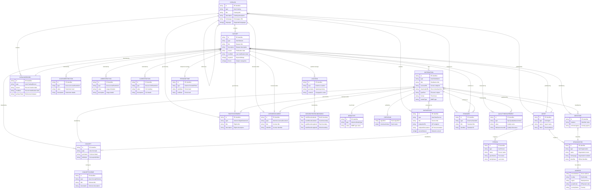

# DCAT-US3 JSON Schema Definition

## Relationship Diagram
This defines the various relationships of the model, and tries to show various metadata relationships.

```mermaid
erDiagram
    %% Core DCAT Entities
    CATALOG {
        string id "IRI identifier"
        string type "dcat:Catalog"
        string title "Catalog title"
        string description "Catalog description"
        string homepage "Homepage URL"
        string[] language "Supported languages"
    }
    
    DATASET {
        string id "IRI identifier" 
        string type "dcat:Dataset"
        string title "Dataset title"
        string description "Dataset description"
        string issued "Publication date"
        string modified "Last modification date"
        string[] keyword "Keywords/tags"
        string[] theme "Subject categories"
    }
    
    DISTRIBUTION {
        string id "IRI identifier"
        string type "dcat:Distribution"
        string title "Distribution title"
        string accessURL "Access endpoint"
        string downloadURL "Direct download link"
        string byteSize "File size in bytes"
        string format "File format"
        string mediaType "MIME type"
    }
    
    DATASERVICE {
        string id "IRI identifier"
        string type "dcat:DataService"
        string title "Service title"
        string endpointURL "API endpoint"
        string endpointDescription "API documentation"
        string[] servesDataset "Datasets served"
    }
    
    CATALOGRECORD {
        string id "IRI identifier"
        string type "dcat:CatalogRecord"
        string issued "Record creation date"
        string modified "Record modification date"
        string primaryTopic "Referenced dataset"
    }
    
    %% Organizational Entities
    AGENT {
        string id "IRI identifier"
        string type "foaf:Agent"
        string name "Agent name"
        string mbox "Email address"
    }
    
    ORGANIZATION {
        string id "IRI identifier"
        string type "foaf:Organization"
        string name "Organization name"
        string homepage "Organization website"
        string identifier "Official identifier"
    }
    
    PERSON {
        string id "IRI identifier"
        string type "foaf:Person"
        string name "Person name"
        string givenName "First name"
        string familyName "Last name"
    }
    
    ADDRESS {
        string streetAddress "Street address"
        string locality "City/locality"
        string region "State/province"
        string postalCode "ZIP/postal code"
        string countryName "Country"
    }
    
    %% Rights and Legal
    RIGHTSSTATEMENT {
        string id "IRI identifier"
        string type "dcterms:RightsStatement"
        string title "Rights title"
        string description "Rights description"
    }
    
    LICENSEDOCUMENT {
        string id "IRI identifier"
        string type "dcterms:LicenseDocument"
        string title "License title"
        string identifier "License identifier"
    }
    
    ACCESSRESTRICTION {
        string id "IRI identifier"
        string type "dcat-us:AccessRestriction"
        string value "Restriction level"
        string description "Restriction details"
    }
    
    USERESTRICTION {
        string id "IRI identifier"
        string type "dcat-us:UseRestriction"
        string value "Usage limitation"
        string description "Usage details"
    }
    
    CUIRESTRICTION {
        string id "IRI identifier"
        string type "dcat-us:CUIRestriction"
        string value "CUI marking"
        string description "CUI details"
    }
    
    %% Spatial and Temporal
    LOCATION {
        string id "IRI identifier"
        string type "dcterms:Location"
        string geometry "Spatial geometry"
        string centroid "Geographic center"
    }
    
    GEOGRAPHICBOUNDINGBOX {
        float northBoundLatitude "North boundary"
        float southBoundLatitude "South boundary"
        float eastBoundLongitude "East boundary" 
        float westBoundLongitude "West boundary"
    }
    
    PERIODOFTIME {
        string id "IRI identifier"
        string type "dcterms:PeriodOfTime"
        string startDate "Period start"
        string endDate "Period end"
    }
    
    %% Technical Metadata
    MEDIATYPE {
        string id "IRI identifier"
        string type "dcterms:MediaType"
        string value "MIME type value"
    }
    
    CHECKSUM {
        string algorithm "Hash algorithm"
        string checksumValue "Hash value"
    }
    
    IDENTIFIER {
        string id "IRI identifier"
        string notation "Identifier value"
        string schemeAgency "Issuing agency"
    }
    
    %% Classification and Quality
    CONCEPT {
        string id "IRI identifier"
        string type "skos:Concept"
        string prefLabel "Preferred label"
        string definition "Concept definition"
    }
    
    CONCEPTSCHEME {
        string id "IRI identifier"
        string type "skos:ConceptScheme"
        string title "Scheme title"
        string description "Scheme description"
    }
    
    STANDARD {
        string id "IRI identifier"
        string type "dcterms:Standard"
        string title "Standard title"
        string identifier "Standard ID"
    }
    
    QUALITYMEASUREMENT {
        string id "IRI identifier"
        string type "dqv:QualityMeasurement"
        string value "Quality value"
        string isMeasurementOf "Quality dimension"
    }
    
    %% Core Relationships - Containment
    CATALOG ||--o{ DATASET : "contains"
    CATALOG ||--o{ DATASERVICE : "contains"  
    CATALOG ||--o{ CATALOGRECORD : "contains"
    CATALOG ||--o{ CATALOG : "references"
    
    DATASET ||--o{ DISTRIBUTION : "has"
    DATASET }o--|| CATALOGRECORD : "described by"
    
    DISTRIBUTION }o--o{ DATASERVICE : "accessed via"
    
    %% Agent Relationships
    CATALOG }o--|| AGENT : "published by"
    DATASET }o--|| AGENT : "published by"
    DISTRIBUTION }o--|| AGENT : "published by"
    
    AGENT ||--o{ ORGANIZATION : "is type of"
    AGENT ||--o{ PERSON : "is type of"
    ORGANIZATION ||--o| ADDRESS : "has address"
    
    %% Identification
    DATASET ||--o{ IDENTIFIER : "identified by"
    DISTRIBUTION ||--o{ IDENTIFIER : "identified by"
    IDENTIFIER }o--|| ORGANIZATION : "issued by"
    
    %% Rights and Legal
    CATALOG ||--o| RIGHTSSTATEMENT : "governed by"
    DATASET ||--o| RIGHTSSTATEMENT : "governed by"
    DISTRIBUTION ||--o| RIGHTSSTATEMENT : "governed by"
    
    CATALOG ||--o| LICENSEDOCUMENT : "licensed under"
    DATASET ||--o| LICENSEDOCUMENT : "licensed under"
    DISTRIBUTION ||--o| LICENSEDOCUMENT : "licensed under"
    
    DATASET ||--o{ ACCESSRESTRICTION : "restricted by"
    DATASET ||--o{ USERESTRICTION : "restricted by"
    DATASET ||--o{ CUIRESTRICTION : "restricted by"
    
    %% Spatial and Temporal
    DATASET ||--o{ LOCATION : "spatial coverage"
    DATASET ||--o| PERIODOFTIME : "temporal coverage"
    LOCATION ||--o| GEOGRAPHICBOUNDINGBOX : "bounded by"
    
    %% Technical Metadata
    DISTRIBUTION ||--o| MEDIATYPE : "has format"
    DISTRIBUTION ||--o| CHECKSUM : "verified by"
    
    %% Classification
    DATASET ||--o{ CONCEPT : "classified by"
    DISTRIBUTION ||--o{ CONCEPT : "classified by"
    DATASERVICE ||--o{ CONCEPT : "classified by"
    CONCEPT }o--|| CONCEPTSCHEME : "belongs to"
    
    CATALOG ||--o{ STANDARD : "conforms to"
    DATASET ||--o{ STANDARD : "conforms to"
    DISTRIBUTION ||--o{ STANDARD : "conforms to"
    
    %% Quality
    DATASET ||--o{ QUALITYMEASUREMENT : "measured by"
    DISTRIBUTION ||--o{ QUALITYMEASUREMENT : "measured by"
```